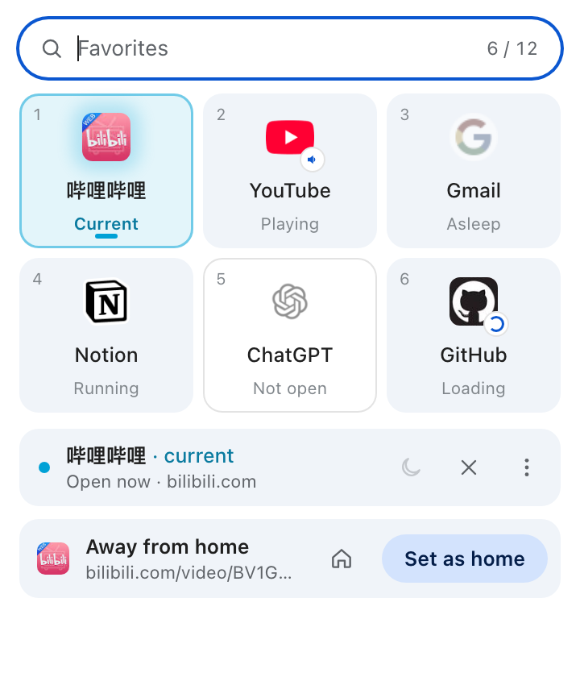
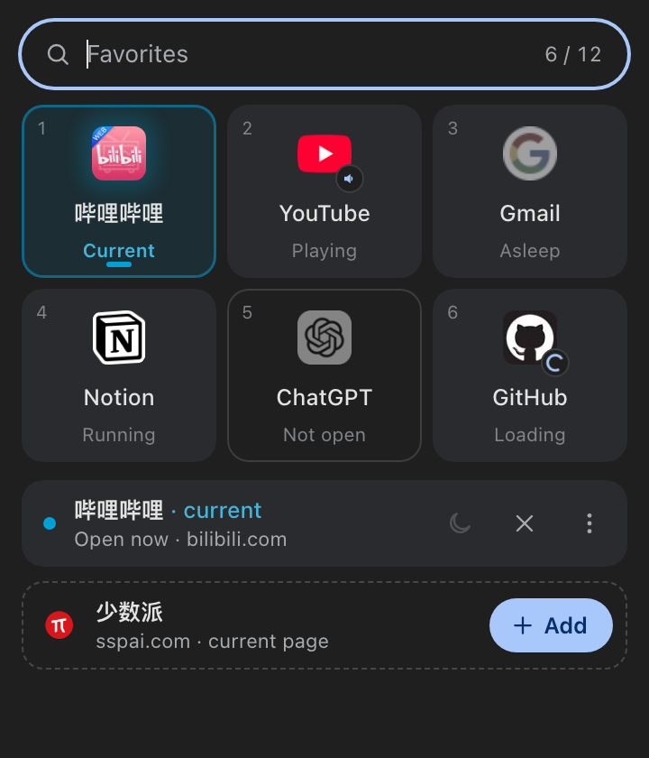

# Bow

**English** · [简体中文](README.zh-CN.md)

Turn your everyday sites into apps. Bow is a Manifest V3 extension that brings Arc-style Favorites to Chrome using Chrome's own **pinned tabs**. Pin a site once and it stays at the top of your tab strip (or Vertical Tabs). It comes back after you close it or restart Chrome, and clicking it always takes you to the same tab.

<p align="center">
  
  
</p>

> Bow is an independent personal project, not affiliated with The Browser Company (Arc), Zen Browser or Google. "Arc" only describes where the idea came from. Site icons in the screenshots belong to their owners and are shown as examples.

## How it's different

Most extensions like this build their own UI: a separate sidebar, a row of icons injected into web pages, or a different browser altogether. Bow does the opposite and **uses only what Chrome already has**:

- **Entries** are native pinned tabs.
- **They live** in Chrome's own tab strip and Vertical Tabs.
- **Memory is saved** by Chrome's own tab discarding.
- **Management** happens in one toolbar popup.

The extension only adds the layer Chrome is missing: it remembers which tabs are "apps", keeps exactly one of each, puts them back after you close them or restart, and decides where links should open.

What you get:
- **Minimal cost.** No permanent sidebar taking up space, no restyled pages, no reliance on Chrome internals. When Chrome redesigns its tab strip, Bow gets the new look instead of breaking.
- **Nothing to undo.** Uninstall it and you're left with ordinary pinned tabs; nothing is lost.

The trade-off is that it can't look exactly like Arc (see [Known limitations](#known-limitations)). In return you get the core of Arc Favorites at the lowest possible cost: your everyday sites stay put like apps, exist exactly once, and are always one click away.

## Features

- **Pinned tabs are the entries.** No sidebar and no changes to web pages. Your entries appear in Chrome's own tab strip and Vertical Tabs.
- **One tab per app.** Each Favorite has exactly one tab across all windows. Clicking switches to it, even across windows; a sleeping one resumes where you left off.
- **Entries that don't go away.** Close one with `Cmd/Ctrl+W` and it comes back in the background, asleep, in the same window. After a restart, Bow matches the tabs Chrome restored instead of adding blank ones.
- **App-home mode.** Links to other sites open in a normal tab while the Favorite stays put. On YouTube, in-site videos open in new tabs too, so the home feed stays the home feed (turn this on for any site in the editor).
- **A popup that's quick to use.**
  - Start typing to filter; `1–9` opens an app directly.
  - The grid adapts to how many apps you have, and each tile shows its state: current, running, playing, asleep, loading or not open.
  - The card at the bottom follows the current page: add a new site, go back home, or make this page the home page.
  - Drag to reorder; the order syncs to your pinned tabs.
- **Automatic names.** Bow uses the name a site declares for itself, or cleans up the page title: "首页-个性推荐-哔哩哔哩" becomes "哔哩哔哩".
- **English and Chinese.** Follows Chrome's UI language; anything other than Chinese gets English.
- **Light and dark mode, keyboard, screen readers and reduced motion** are all supported.

## Install

1. Download `bow-v*.zip` from [Releases](https://github.com/IJPP/bow/releases/latest) and unzip it (or clone this repo and use the prebuilt **`dist`** folder).
2. Open `chrome://extensions/`, turn on **Developer mode** in the top right, click **Load unpacked** and choose the unzipped folder.
3. Pin Bow to the toolbar. `Cmd/Ctrl+Shift+Y` opens the popup.

To upgrade, replace the folder and click **Reload** on the extension's card. Your data is kept.

## Usage

- **Add:** right-click a tab and choose **Pin**, right-click a page and choose **Add to Favorites**, or click **Add** at the bottom of the popup.
- **Open or switch:** click an icon in the popup, or press `1–9`.
- **Manage:** hover an icon for `⋮`, right-click it, or use the detail strip to sleep, close the page, go back home, edit or remove.
- **Remove:** unpin the tab in Chrome, or remove it in the popup (the page stays as a normal tab).

You can have one Favorite per site (by hostname; `www.` is ignored) and up to 12 in total.

| Action | Result |
| --- | --- |
| Click a Favorite | Switches to its tab; wakes it if asleep; opens it from its home page if closed |
| Sleep | Frees memory and keeps the pinned entry and current address |
| Close page | Closes the tab but keeps the Favorite; it reopens from its home page |
| `Cmd/Ctrl+W` | Restores the entry in the background, asleep, without stealing focus |
| Close the whole window | Keeps the Favorite and doesn't reopen the window |

### Keyboard

| Key | Action |
| --- | --- |
| Type | Filter |
| `1–9` | Open that position |
| Arrows / `Enter` | Select / open |
| `Esc` | Clear the filter |
| `F2` | Edit |
| `Shift+F10` | Manage menu |
| `Alt+Shift+Arrows` | Reorder |

## Link rules

These apply only inside a Favorite's own tab:

- **Plain links within the site** stay in the Favorite. Links the site itself opens in a new tab still open in a new tab.
- **Links to other sites** open in a normal tab, and the Favorite stays put.
- **Links to another Favorite** switch to that Favorite instead of loading it here.
- **With "Open in-site links in a new tab too" on**, every in-site link opens in a new tab.
- **Modifier-key clicks, downloads, form submissions and script navigation** keep Chrome's default behavior.

## Privacy and permissions

- **Permissions:** `tabs`, `storage`, `contextMenus`, `scripting`, `favicon`, and access to http/https sites.
- **What they're for:** managing pinned tabs, installing the link rules in Favorite pages, reading the name a site declares for itself, and showing icons from Chrome's local favicon cache.
- **What Bow doesn't do:** read page content, make network requests, or use accounts, analytics or telemetry.
- **Where data lives:** everything stays in `chrome.storage` on your device. The diagnostic log is local too; you copy it from the popup only when you need it.
- **If site access is withdrawn:** if you restrict site access in the extension's details, link rules stop working. The popup tells you, and **Allow** turns them back on.

## Known limitations

- An extension can't draw a dedicated Favorites area in Chrome's tab strip, or change how native tabs look or what their right-click menu offers.
- Chrome draws the toolbar popup's frame and shadow; an extension can only design what's inside it.
- An extension can't intercept `Cmd/Ctrl+W`. Bow can only restore the entry after it closes, and waking a sleeping tab reloads the page.
- Each Favorite is a single tab shared by all windows, unlike Arc Spaces, which show a set per window.
- Arc's Peek can't be reproduced reliably, so links to other sites open in normal tabs.

## Development

```bash
npm install
npm run dev       # popup preview with sample data: open Vite's address + /popup.html
npm run check     # TypeScript + Vitest
npm run build     # build dist
npm run package   # build dist and the zip
```

- **Code layout:** the popup is in `src/popup/` (Preact), the background and domain logic in `src/core/`, UI strings in `src/core/i18n.ts`, the extension's name in `public/_locales/`, and the icon is generated by `scripts/generate-icons.mjs`.
- **Preview parameters:** `?n=0–12` sets the number of apps, `?ctx=addable|favorite|deep|unsupported` simulates the current page, `?noaccess=youtube.com` simulates missing site access, and `?lang=en|zh` switches the language.
- **QA:** test results and what still needs checking in real Chrome are in [QA.md](QA.md) (Chinese).

## Changelog

### 0.7.0

- Added an English interface and made it the default: Chrome set to Chinese shows Chinese, everything else shows English. The README is now available in English too.
- New icon: three app cards fanned around one point, their top edges forming a bow.

### 0.6.1

- Renamed to Bow (formerly Favorites for Chrome) so the name no longer uses "Arc". The extension ID and your data are unchanged.

### 0.6.0

- Rebuilt the popup in Preact: filter box, adaptive grid, detail strip, current-page card, an editor that expands from the tile, and spring animations.
- Fixed extra about:blank pinned tabs after a restart: new tabs only sleep after their page commits, leftover blank tabs are reused before new ones are created, and the popup can close them in one click.
- Fixed link rules never taking effect: site access is now checked separately for http and https. Added app-home mode, on by default for YouTube.
- Automatic app names, a local diagnostic log, and a redrawn icon.

## License

[MIT](LICENSE) © 2026 IJPP
