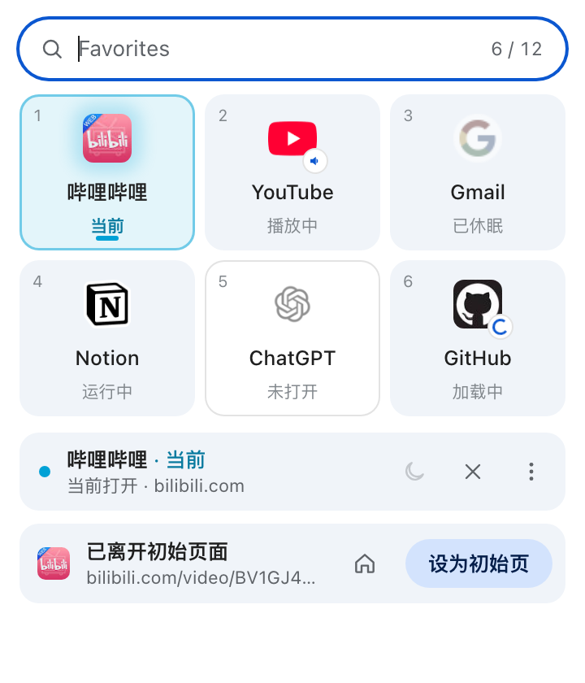
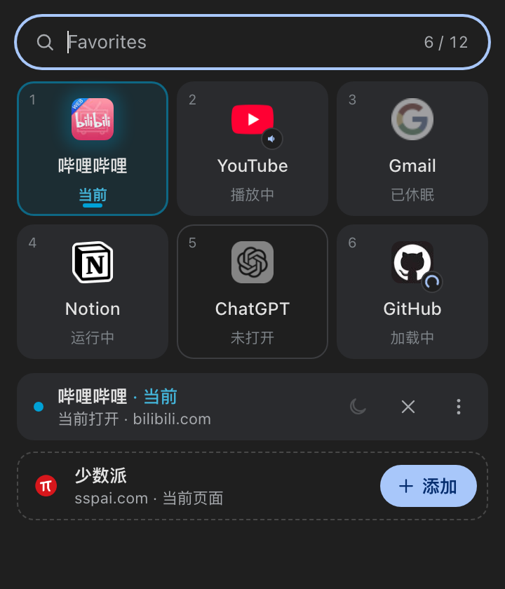

# Favorites for Chrome

把常用网站变成 App：一个 Manifest V3 扩展，用 Chrome **原生固定标签**实现 Arc 式的 Favorites。固定一次，入口就一直在标签栏（或 Vertical Tabs）最上方；关掉、重启都会回来，点开永远是同一个实例。

<p align="center">
  
  
</p>

> 这是一个独立的个人项目，与 The Browser Company（Arc）、Zen Browser 或 Google 均无关联。“Arc”仅用于描述交互灵感。截图中的网站图标属于各自的所有者，仅作示例。

## 功能

- **原生固定标签就是入口。** 不加侧栏、不改网页，入口出现在 Chrome 自己的标签栏和 Vertical Tabs 里。
- **单实例。** 每个 Favorite 全局只有一个标签：点击就切过去，跨窗口也一样；已休眠的会从上次的网址恢复。
- **关不掉的入口。** `Cmd/Ctrl+W` 关闭后，入口会在原窗口后台补回并进入休眠；Chrome 重启后自动匹配恢复，不会多出空白标签。
- **App 主页模式。** 外站链接自动在普通标签打开，Favorite 留在原处；YouTube 默认连站内视频也开新标签，首页始终是首页（其他网站可在编辑面板开启）。
- **好用的管理弹窗。**
  - 打开即可打字筛选，`1–9` 直达；
  - 网格随数量自适应，每个应用标明状态（当前、运行中、播放中、已休眠、加载中、未打开）；
  - 底部卡片跟随当前页面：添加新网站、回到初始页、把当前页设为初始页；
  - 拖动排序会同步到原生标签。
- **自动取名。** 优先使用网站声明的应用名，其次清洗标题：“首页-个性推荐-哔哩哔哩”显示为“哔哩哔哩”。
- **深浅色、键盘操作、读屏器和“减少动态效果”** 都已适配。

## 安装

1. 从 [Releases](https://github.com/IJPP/arc-favorites/releases/latest) 下载 `favorites-for-chrome-v*.zip` 并解压（或克隆本仓库，使用其中已构建好的 **`dist`** 文件夹）。
2. 打开 `chrome://extensions/`，开启右上角“开发者模式”，点“加载已解压的扩展程序”，选择解压出的文件夹。
3. 建议把 Favorites 固定到工具栏，快捷键 `Cmd/Ctrl+Shift+Y` 打开弹窗。

升级时在扩展卡片上点“重新加载”即可，数据会保留。

## 使用

- **添加**：在标签上右键“固定标签页”，或在网页右键“加入 Favorites”，或在弹窗底部点“添加”。
- **打开 / 切换**：点弹窗里的图标，或按 `1–9`。
- **管理**：悬停图标出现 `⋮`，也可以右键或用详情条，可以休眠、关闭页面、回到初始页、编辑、移除。
- **移除**：在 Chrome 里取消固定，或在弹窗里移除（页面保留为普通标签）。

每个网站（按主机名，`www.` 视为相同）最多一个 Favorite，总数最多 12 个。

| 操作 | 结果 |
| --- | --- |
| 点击 Favorite | 切到已有实例；休眠则恢复；未打开则从初始网址新建 |
| 休眠 | 释放内存，保留固定入口和当前网址 |
| 关闭页面 | 关掉标签，保留 Favorite；下次从初始网址打开 |
| `Cmd/Ctrl+W` | 后台补回入口并休眠，不抢焦点 |
| 关闭整个窗口 | 保留定义，不重新弹出窗口 |

### 键盘

| 按键 | 作用 |
| --- | --- |
| 直接打字 | 筛选 |
| `1–9` | 打开对应位置 |
| 方向键 / `Enter` | 选择 / 打开 |
| `Esc` | 清空筛选 |
| `F2` | 编辑 |
| `Shift+F10` | 管理菜单 |
| `Alt+Shift+方向键` | 排序 |

## 链接规则

只在 Favorite 自己的标签里生效：

- **站内普通链接**留在 Favorite；网站本身要求新标签打开的链接照常开新标签。
- **外站链接**在普通标签打开，Favorite 不动。
- **指向另一个 Favorite 的链接**直接切到那个 Favorite，不会在当前标签打开它。
- **开启“站内链接也开新标签”后**，站内链接一律开新标签。
- **按住修饰键的点击、下载、表单提交、脚本跳转**保持 Chrome 默认行为。

## 隐私与权限

- **用到的权限**：`tabs`、`storage`、`contextMenus`、`scripting`、`favicon`，以及 http/https 网站访问。
- **用途**：管理固定标签，在 Favorite 页面里安装链接规则，读取网站声明的应用名，显示 Chrome 本地缓存的网站图标。
- **不做的事**：不读取网页正文，不联网，没有账号、统计或遥测。
- **数据存放**：全部保存在本机 `chrome.storage`。诊断日志也只在本机，需要时从弹窗手动复制。
- **权限被收回时**：如果在扩展详情里收紧了网站访问权限，链接规则不会生效，弹窗会提示，点“允许”即可恢复。

## 已知限制

- 扩展无法在 Chrome 标签栏里画一个专属的 Favorites 区域，也无法改动原生标签的样式或右键菜单。
- 工具栏弹窗的外框和阴影由 Chrome 绘制，扩展只能设计框内的内容。
- 扩展无法拦截 `Cmd/Ctrl+W`，只能在关闭后补回入口；休眠后唤醒会重新加载页面。
- Favorite 是全局单实例，不像 Arc Spaces 那样在每个窗口各显示一份。
- Arc 的 Peek 无法可靠复刻，外站链接改为在普通标签打开。

## 开发

```bash
npm install
npm run dev       # 弹窗预览（示例数据），访问 Vite 输出的地址 + /popup.html
npm run check     # TypeScript + Vitest
npm run build     # 生成 dist
npm run package   # 生成 dist 与 zip
```

- **代码结构**：弹窗在 `src/popup/`（Preact），后台与领域逻辑在 `src/core/`，图标由 `scripts/generate-icons.mjs` 生成。
- **预览参数**：`?n=0–12` 设置应用数量，`?ctx=addable|favorite|deep|unsupported` 模拟当前页面情形，`?noaccess=youtube.com` 模拟权限缺失。
- **验证记录**：测试结果和仍需在真实 Chrome 中验证的项目见 [QA.md](QA.md)。

## 更新记录

### 0.6.0

- 弹窗用 Preact 重写，包括筛选框、自适应网格、详情条、当前页面卡片、从图标展开的编辑面板和弹簧动效。
- 修复重启后多出 about:blank 固定标签：新标签提交后才休眠，补建前先复用遗留的空白标签，弹窗可一键清理。
- 修复链接规则从未生效：权限检查改为分别检查 http 和 https；新增 App 主页模式，YouTube 默认开启。
- 自动取应用名；新增本机诊断日志；重绘图标。

## 许可证

[MIT](LICENSE) © 2026 IJPP
